# Ouroboros

> **Research that feeds itself.** A self-verifying production-intelligence agent for film & TV, built on Google Cloud's Gemini/Agent Development Kit stack with Parallel Web Systems as the research layer.
>
> Built for *Agentic Cinema: The Blockbuster Hackathon* — **Parallel track**.

**Live app:** [web-492372502792.us-central1.run.app](https://web-492372502792.us-central1.run.app)
· **Architecture:** [/docs/architecture](https://web-492372502792.us-central1.run.app/docs/architecture)
· **How it works:** [/how-it-works](https://web-492372502792.us-central1.run.app/how-it-works)
· **Full write-up:** [/docs](https://web-492372502792.us-central1.run.app/docs)

**Demo video:** _recorded for submission — see [`docs/DEMO_SCRIPT.md`](docs/DEMO_SCRIPT.md) for the shot list._

Any Google account can sign in and get full demo access — see [Access for judges](#access-for-judges) below.

---

## What it does

A clearance memo is true on the day it's written and quietly less true every day after — a trademark dispute gets filed, a historical figure's Wikipedia page gets corrected, a monitored artist gets dropped by their label — and nobody finds out which parts rotted until someone is standing in a colour suite a week from delivery. Ouroboros treats a film as a set of claims about the real world (this brand can appear on this shelf, this event happened on this date) and keeps re-verifying every one of them against the live web, on a cadence that tightens automatically as release approaches, instead of producing a clearance report that's a photograph of a moving target.

A script or a cut lands in Cloud Storage; Gemini extracts every legal and factual claim it makes; ADK agents research each one through Parallel's Search and Task APIs into a per-field evidence record with citations and confidence, never a bare verdict; every verified claim gets a Parallel Monitor watching it against the real world; when something changes, a webhook fires, the claim is re-verified, and the project's Reality Drift score — how much of its risk picture has moved since anyone last looked — updates. The full reasoning behind this, including the production bugs that shaped it, is written up on the live site's own [`/docs`](https://web-492372502792.us-central1.run.app/docs).

## The three loops

1. **Ingest → Triage → Verify.** A script or cut is read once by Gemini into a claim ledger; a triage step checks the studio's own history for a near-identical claim already resolved on a past production before any real research runs.
2. **Verify → Watch → Drift → Verify.** The loop that actually repeats: every verified claim is watched by a Parallel Monitor; a real detected change re-verifies it, rescoring risk and moving Reality Drift; the cycle re-enters at Verify, not back at Ingest — the script hasn't changed, only the world has.
3. **The loop that runs backwards.** A Parallel Task researching a claim can call back into Ouroboros's own ledger — read-only, bearer-gated, no Google credential ever leaves the perimeter — to ask what this studio decided about this brand or this person on a previous production.

## Architecture

```mermaid
flowchart LR
    %% ───────────────────────── INGEST ─────────────────────────
    subgraph INGEST["1 · INGEST (Google Cloud)"]
        GCS[("Cloud Storage<br/>scripts & rough cuts")]
        EA["Eventarc<br/>object.finalize"]
        ING["Cloud Run · Ingest Service"]
        GEM_DOC["Gemini<br/>document understanding<br/>(multilingual scripts)"]
        GEM_VID["Gemini<br/>video understanding<br/>(timestamped transcript,<br/>on-screen text)"]
        ARMOR["Model Armor<br/>prompt-injection screen"]
        GCS --> EA --> ING
        ING --> GEM_DOC
        ING --> GEM_VID
        GEM_DOC --> ARMOR
        GEM_VID --> ARMOR
    end

    %% ───────────────────────── LEDGER ─────────────────────────
    subgraph DATA["2 · CLAIM LEDGER (Google Cloud)"]
        SQL[("Cloud SQL<br/>claim ledger")]
        TOOLBOX["MCP Toolbox for Databases<br/>(managed MCP server)"]
        FS[("Firestore<br/>live claim state + event feed")]
        BQ[("BigQuery<br/>ledger analytics +<br/>Parallel remote functions")]
        SM["Secret Manager<br/>PARALLEL_API_KEY"]
        SQL --- TOOLBOX
        SQL --> BQ
    end
    ARMOR -->|"Claim Ledger<br/>legal + factual claims"| SQL

    %% ───────────────────────── AGENTS ─────────────────────────
    subgraph AGENTS["3 · ORCHESTRATION (Agent Engine · ADK)"]
        COORD["Coordinator agent"]
        subgraph FAN["ParallelAgent fan-out"]
            A_MUSIC["Music agent"]
            A_BRAND["Brand / Trademark agent"]
            A_PERSON["Persons / Likeness agent"]
            A_LOC["Locations / Art agent"]
            A_FACT["Factual Claims agent<br/>(TRUE CUT)"]
        end
        RISK["RiskAssessor agent<br/>risk score + Reality Drift"]
        REPORT["Reporter agent<br/>E&O evidence pack ·<br/>clearance log · fact-check"]
        QA["Conversational Q&A<br/>Gemini + ToolParallelAiSearch<br/>+ Vertex AI Search (private corpus)"]
        EVAL["Vertex AI Evaluation<br/>golden-set evals"]
        A2A["A2A protocol<br/>CLEAR ⇄ TRUE CUT (stretch)"]
        COORD --> FAN
        FAN --> RISK --> REPORT
        A_FACT -. A2A .- A_PERSON
    end
    SQL --> COORD
    TOOLBOX -->|"MCP tools"| COORD
    SM -.-> COORD
    REPORT --> FS
    RISK --> BQ

    %% ───────────────────────── PARALLEL ─────────────────────────
    subgraph PARALLEL["4 · PARALLEL WEB SYSTEMS (research layer)"]
        P_SEARCH["Search API<br/>fast · geo location ·<br/>exclude_domains · after_date"]
        P_TASK["Task API<br/>core-fast → pro escalation<br/>structured schema + Basis<br/>(citations · reasoning · confidence)"]
        P_RESP["Responses API<br/>medium effort · sync ·<br/>structured cited answers"]
        P_ENTITY["Entity Search<br/>publishers · labels · estates"]
        P_EXTRACT["Extract API<br/>licensing & archive pages"]
        P_MON["Monitor API<br/>snapshot on Task outputs ·<br/>event-stream on stories"]
        P_MEM["Parallel Memory<br/>memory_scope_key per studio"]
        P_SLACK["Slack integration"]
        P_MON --> P_SLACK
    end
    A_MUSIC & A_BRAND & A_PERSON & A_LOC -->|"triage"| P_SEARCH
    P_SEARCH -->|"escalate"| P_TASK
    A_FACT --> P_RESP
    P_RESP -->|"contested claims"| P_TASK
    A_PERSON --> P_ENTITY
    A_FACT --> P_EXTRACT
    P_TASK -->|"remote MCP tool call<br/>(two-way integration)"| TOOLBOX
    P_TASK <--> P_MEM
    P_TASK -->|"high-risk findings"| P_MON

    %% ───────────────────────── OUROBOROS LOOP ─────────────────────────
    subgraph LOOP["5 · OUROBOROS LOOP (re-verification)"]
        WH["Cloud Run · Webhook Receiver"]
        PS["Pub/Sub<br/>verification-events"]
        REVERIFY["Re-verification Task run<br/>previous_interaction_id = event_id"]
        SCHED["Cloud Scheduler<br/>“the coil tightens”<br/>1w → 1d → 1h before release"]
        WH --> PS --> REVERIFY
        SCHED -->|"update frequency"| P_MON
    end
    P_MON -->|"monitor.event.detected"| WH
    REVERIFY --> P_TASK
    REVERIFY -->|"updated claim"| SQL

    %% ───────────────────────── REMEDIATION ─────────────────────────
    subgraph REMEDY["6 · REMEDIATION (stretch — not attempted)"]
        LYRIA["Lyria<br/>royalty-free temp cue"]
        IMG["Gemini image gen<br/>fictional brand / prop mockup"]
    end
    RISK -->|"unclearable"| LYRIA
    RISK -->|"unclearable"| IMG

    %% ───────────────────────── PRESENTATION ─────────────────────────
    subgraph UI["7 · PRESENTATION & GOVERNANCE"]
        AUTH["Google Identity Services<br/>role allowlist: Legal · Editorial ·<br/>Producer · open-access Judge"]
        DASH["Cloud Run · Dashboard<br/>script risk heatmap ·<br/>video claim timeline ·<br/>live monitor feed · Reality Drift"]
        EXPORT["Exports<br/>E&O evidence pack (PDF) ·<br/>fact-check report (PDF) ·<br/>clearance log (CSV)"]
        LIVE["Gemini Live API<br/>on-set voice Q&A (stretch — not attempted)"]
        OBS["Cloud Logging / Trace<br/>per-claim observability"]
        AUTH --> DASH --> EXPORT
        DASH --> LIVE
    end
    FS --> DASH
    QA --> DASH
    LIVE --> QA
    AGENTS -.-> OBS
    AGENTS -.-> EVAL

    classDef gcp fill:#1a2a44,stroke:#4a90e2,color:#e8f0fe
    classDef parallel fill:#3a2612,stroke:#fb631b,color:#ffe8d6
    classDef loop fill:#2a1a3a,stroke:#b57bee,color:#f3e8ff
    classDef stretch fill:#1f2a1f,stroke:#7ac47a,color:#e6f5e6,stroke-dasharray: 5 5
    class GCS,EA,ING,GEM_DOC,GEM_VID,ARMOR,SQL,TOOLBOX,FS,BQ,SM,COORD,A_MUSIC,A_BRAND,A_PERSON,A_LOC,A_FACT,RISK,REPORT,QA,EVAL,AUTH,DASH,EXPORT,OBS gcp
    class P_SEARCH,P_TASK,P_RESP,P_ENTITY,P_EXTRACT,P_MON,P_MEM,P_SLACK parallel
    class WH,PS,REVERIFY,SCHED loop
    class LYRIA,IMG,LIVE,A2A stretch
```



Solid nodes are built and live. Dashed nodes (Lyria remediation, a fictional-brand mockup, Gemini Live on-set Q&A, and CLEAR↔TRUE CUT agent-to-agent handoff) were optional stretch goals that were never attempted — kept on the diagram rather than quietly deleted, so the gap between planned and shipped stays visible. Source: [`ouroboros_architecture.mermaid`](ouroboros_architecture.mermaid) — the same file renders live on the site at [`/docs/architecture`](https://web-492372502792.us-central1.run.app/docs/architecture). The full reasoning behind this shape — what we tried first, what broke, why the return path is a chord back into Verify and not another lap — is at [`/docs/approach`](https://web-492372502792.us-central1.run.app/docs/approach).

## Parallel API usage

Every call below is real code, not a described capability — the mode/processor choices come from `config/parallel.py`'s cost table and `agents/ouroboros/tools/parallel_tools.py`'s escalation logic, not a fixed setting.

| API | Used by | Where | Purpose |
|---|---|---|---|
| Search | Every CLEAR specialist's first pass | [`packages/parallel_client/search.py`](packages/parallel_client/search.py) → `search()`, called from [`agents/ouroboros/tools/parallel_tools.py`](agents/ouroboros/tools/parallel_tools.py) | Cheap first pass: does this entity have an obvious rights holder, is this claim obviously settled |
| Task | Escalated claims; every re-verification | [`packages/parallel_client/task.py`](packages/parallel_client/task.py) → `run()`, `fetch_result()`, `should_escalate()` | Structured per-field evidence (Basis: citations, reasoning, confidence), `core-fast` → `pro` escalation only when confidence is low **and** priority is high |
| Responses | TRUE CUT's fast factual pass | [`packages/parallel_client/responses.py`](packages/parallel_client/responses.py) — via the `openai` SDK, `base_url="https://api.parallel.ai/v1"` | Synchronous cited answers for straightforward factual claims, escalating to Task when contested |
| Entity Search | Person/likeness claims | [`packages/parallel_client/entity.py`](packages/parallel_client/entity.py) → `client.beta.findall.entity_search()` | Publisher, label, and estate lookups for rights-holder identification |
| Extract | Archival/licensing claims | [`packages/parallel_client/extract.py`](packages/parallel_client/extract.py) → `extract()` | Full-content pulls from licensing and archive pages |
| Monitor | Every verified claim | [`packages/parallel_client/monitor.py`](packages/parallel_client/monitor.py) → `create_snapshot()`, `create_stream()` | The re-verification loop itself — cadence tightens 1w → 1d → 1h as release approaches |
| Memory | Triage, before any real research | `memory_scope_key` per studio, in [`agents/ouroboros/tools/parallel_tools.py`](agents/ouroboros/tools/parallel_tools.py) | Recognizes a claim this studio already resolved on a past production |
| **MCP (two-way)** | Every Task run | [`services/toolbox_public/`](services/toolbox_public/) — bearer-gated, 3 read-only tools | Parallel's own research calls back into our claim ledger mid-run, without ever holding a Google credential |

## Google Cloud usage

| Service | Where | Purpose |
|---|---|---|
| Cloud Run | 7 services under [`services/`](services/) and [`web/`](web/) | Every deployed service — ingest, dashboard API, webhook receiver, re-verify worker, both Toolbox services, and the web app itself |
| Vertex AI Agent Engine | [`agents/ouroboros/`](agents/ouroboros/), deployed via [`agents/deploy/deploy.py`](agents/deploy/deploy.py) | Runs the ADK agent tree (CLEAR, TRUE CUT, AskOuroboros) |
| Gemini (document + video understanding) | [`packages/gemini_client/documents.py`](packages/gemini_client/documents.py), [`packages/gemini_client/video.py`](packages/gemini_client/video.py) | Claim extraction from scripts and cuts |
| Gemini (grounded generation) | [`packages/gemini_client/grounding.py`](packages/gemini_client/grounding.py) → `ask_grounded()` | AskOuroboros's grounded Q&A path |
| Vertex AI Search | [`agents/ouroboros/tools/corpus_tools.py`](agents/ouroboros/tools/corpus_tools.py) → `search_private_corpus()` | The studio's own private clearance-memo corpus, as a second grounding source |
| Cloud SQL (Postgres) | [`packages/ledger/`](packages/ledger/) | System of record: projects, assets, claims, evidence, risk, cost events |
| Firestore | [`packages/ledger/projections.py`](packages/ledger/projections.py) → `Projector` | Denormalized live views the dashboard reads directly |
| BigQuery | [`infra/modules/bigquery/`](infra/modules/bigquery/) | Nightly + streaming ledger mirror for analytics |
| Model Armor | [`packages/safety/model_armor.py`](packages/safety/model_armor.py) → `screen()` | Screens every extracted claim, every web excerpt, and every agent task output |
| Cloud Trace / Logging | [`packages/common/tracing.py`](packages/common/tracing.py) | One real trace per request, across every service |
| Cloud Monitoring | [`infra/modules/monitoring/`](infra/modules/monitoring/) | Dashboards, log-based metrics, 4 alert policies routed to a real notification channel |
| Vertex AI Evaluation | [`evals/run_vertex.py`](evals/run_vertex.py) | Golden-set coherence/groundedness/Q&A-quality scoring |
| Google Identity Services | [`services/dashboard_api/auth.py`](services/dashboard_api/auth.py) | Sign-in + role gate (replaces Cloud IAP — this project's GCP project has no Organization, which IAP's OAuth Admin APIs require) |
| Pub/Sub, Eventarc, Cloud Scheduler | [`infra/modules/pubsub/`](infra/modules/pubsub/), [`infra/modules/eventarc/`](infra/modules/eventarc/), [`infra/modules/scheduler/`](infra/modules/scheduler/) | Event plumbing: ingest triggers, the re-verification queue, and the daily cadence-tightening job |

## Access for judges

Sign in at the live URL with **any Google account** — you don't need to be pre-registered. An unrecognized email gets a `judge` identity with full access by default (run CLEAR/TRUE CUT, override any claim), and a **"Viewing as"** switcher in the sidebar lets you preview the real per-role gating (Legal / Editorial / Producer) exactly as a real studio user would experience it — Producer genuinely can't start a run, Legal genuinely can't override a factual claim. See [`/docs/architecture`](https://web-492372502792.us-central1.run.app/docs/architecture) for how this is wired server-side (`DASHBOARD_DEMO_OPEN_ACCESS`, never a client-side-only gate).

## Quickstart

```bash
git clone https://github.com/something1703/ouroboros.git
cd ouroboros
make setup                # uv sync + pre-commit install
cp .env.example .env      # fill in your own GCP project / Parallel API key
docker compose up -d      # local Postgres + Toolbox
make test                 # offline suite, no live calls
```

Running against real deployed infrastructure (`make deploy`) needs a GCP project with the APIs in `infra/` enabled and a Parallel API key in Secret Manager — see `phases/PHASE_01.md` for the full one-time setup this project itself followed.

## Running the demo project

The live dashboard's `demo` project is a real, continuously-running instance — not a snapshot. Sign in, open **Demo Film**, and every action (Run CLEAR, Trigger monitors, Ask Ouroboros) is a real call against the same infrastructure this README describes, not a mocked response.

## Evaluation results

Measured against a hand-authored 50-claim golden set (25 legal, 25 factual; 14 jurisdictions; 5 non-English claims) run live against the real pipeline — see [`docs/evidence/09-golden.md`](docs/evidence/09-golden.md) for the full methodology and a documented open caveat about run-to-run variance.

| Metric | Legal | Factual | Bar |
|---|---|---|---|
| Field accuracy | 92% | 88% | ≥85% |
| Citation presence | 92% | 100% | — |
| High-confidence precision | 94% | 88% | ≥90% |
| Errors | 0 | 0 | — |

7 ADK eval sets pass in CI; Vertex AI Evaluation scores RiskAssessor coherence at 4.1/5 and AskOuroboros Q&A quality at 4.8/5 over real generated runs — see [`docs/evidence/09-evals.md`](docs/evidence/09-evals.md).

## Cost

| | |
|---|---|
| CLEAR (per legal claim) | $0.024 |
| TRUE CUT (per factual claim) | $0.053 |
| Full 62-claim CLEAR pass | $1.54 |
| Estimated per script, end to end | ~$2.30 *(part-estimated — real per-unit rates, an assumed claim mix)* |
| Monitored claim in release week | $0.24/day (hourly checks) |
| Per-project research budget cap | $10, hard-enforced |

Full breakdown, including one known gap (`CostMeter.record_actual()` is never called from a production path, so a failed Task is billed at its pre-flight estimate): [`docs/COST.md`](docs/COST.md).

## Security

Model Armor screens every untrusted text path; a red-team pass found and fixed a real fail-closed detector bug and widened the block threshold, with the 4 remaining undetected payload classes enumerated rather than hidden. Every write endpoint enforces its role gate server-side. Full writeup, including a documented incomplete item (the re-verification webhook secret is still a placeholder in this deployment): [`docs/SECURITY.md`](docs/SECURITY.md).

## What's not finished

Written down rather than quietly omitted — full detail at [`/docs/running-it`](https://web-492372502792.us-central1.run.app/docs/running-it):
- The re-verification loop's tail (webhook → new evidence → Slack) has never run against a real signed delivery — the production webhook secret is a placeholder.
- Video ingest is exercised on one film at 50% claim recall, below its own 85% target.
- Remediation (Lyria, brand-mockup generation) and Gemini Live were stretch goals, not attempted.
- `dev` and the live demo are the same infrastructure — one GCP project, not separate environments.

## Roadmap

- Real remediation suggestions (Lyria temp cues, fictional-brand mockups) consuming the `remediation_kind` field RiskAssessor already sets but nothing reads yet.
- A real signed webhook secret, to actually prove the re-verification tail end to end.
- Video ingest recall above its 85% target (currently 50% on the one film tested).
- CLEAR ↔ TRUE CUT agent-to-agent handoff for claims that are genuinely both legal and factual.

## License

[Apache License 2.0](LICENSE).

## Team

_Add team names/handles here before submission._

---

Full planning package (the pre-build architecture, data model, agent catalog, and Parallel integration contracts every phase implemented against) lives in [`docs/plan/`](docs/plan/). The real, evidence-backed decision log for every non-obvious choice and production bug found while building this is [`docs/DECISIONS.md`](docs/DECISIONS.md).
